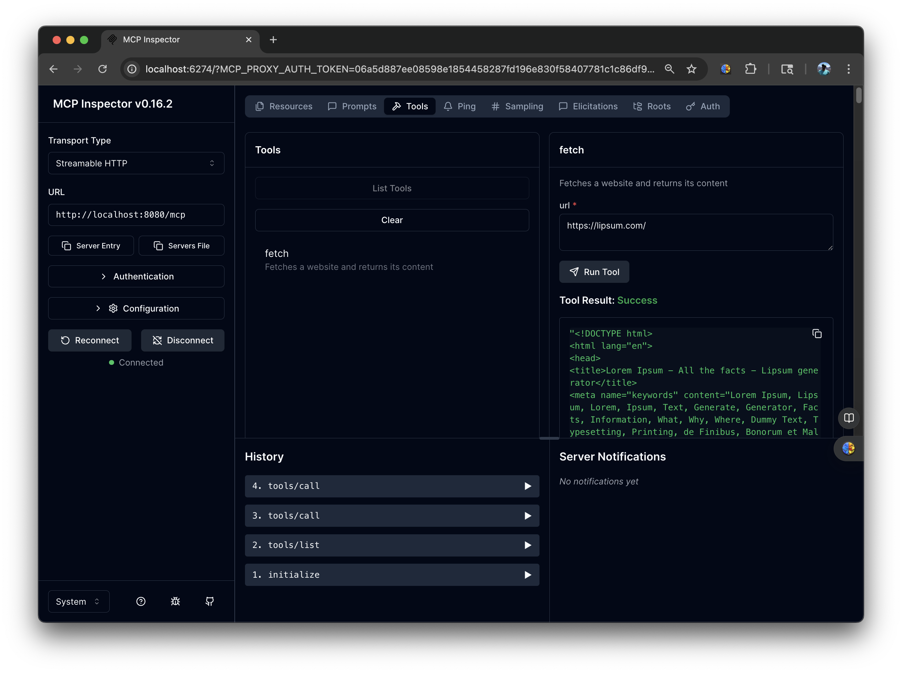
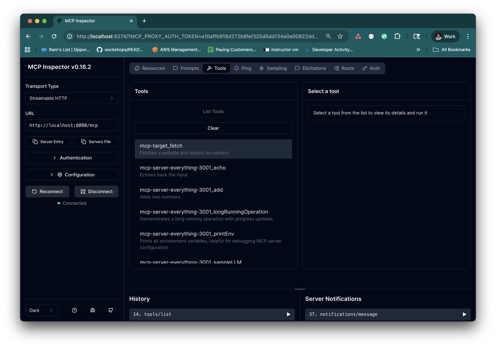
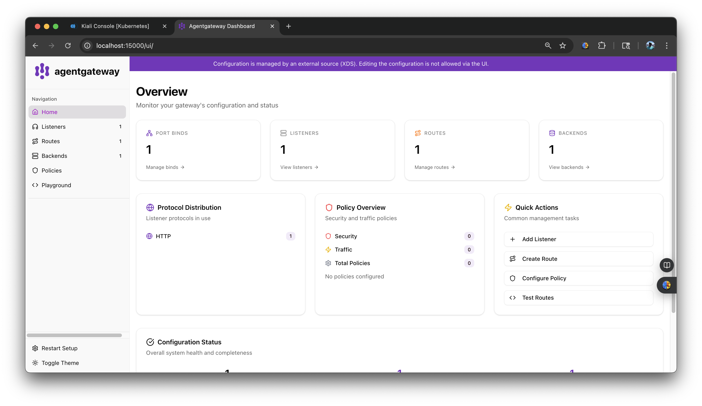
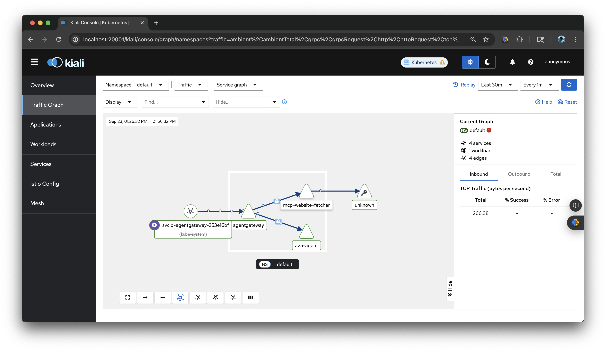

# Solo AI Demo

## Install Everything

### Create k3s cluster
```
k3d cluster create solo-demo --api-port 6550 -p '9080:80@loadbalancer' -p '9443:443@loadbalancer' --agents 2 --k3s-arg '--disable=traefik@server:*'
```

### Gateway API CRDs
```
kubectl apply -f https://github.com/kubernetes-sigs/gateway-api/releases/download/v1.3.0/experimental-install.yaml
```

### Install Istio

Install Istio using istioctl:
```
curl -L https://istio.io/downloadIstio | sh -

istio-1.27.1/bin/istioctl install --set profile=ambient --set values.global.platform=k3d
```

Enable it for default ns:
```
kubectl label ns default istio.io/dataplane-mode=ambient
```

### Install Prometheus and Kiali:
```
kubectl apply -f https://raw.githubusercontent.com/istio/istio/release-1.27/samples/addons/prometheus.yaml
kubectl apply -f https://raw.githubusercontent.com/istio/istio/release-1.27/samples/addons/kiali.yaml
```

### Install kgateway
Deploy the kgateway CRDs by using Helm.
```
helm upgrade -i --create-namespace --namespace kgateway-system --version v2.1.0-main \
kgateway-crds oci://cr.kgateway.dev/kgateway-dev/charts/kgateway-crds \
--set controller.image.pullPolicy=Always

helm upgrade -i --namespace kgateway-system --version v2.1.0-main kgateway oci://cr.kgateway.dev/kgateway-dev/charts/kgateway \
  --set agentgateway.enabled=true  \
  --set controller.image.pullPolicy=Always
```


## Static MCP Server

Deploy MCP Server to Kubernetes. We'll then use it's Service endpoint in agentgateway to call it.
```yaml
kubectl apply -f- <<EOF
apiVersion: apps/v1
kind: Deployment
metadata:
  name: mcp-website-fetcher
spec:
  selector:
    matchLabels:
      app: mcp-website-fetcher
  template:
    metadata:
      labels:
        app: mcp-website-fetcher
    spec:
      containers:
      - name: mcp-website-fetcher
        image: ghcr.io/peterj/mcp-website-fetcher:main
        imagePullPolicy: Always
---
apiVersion: v1
kind: Service
metadata:
  name: mcp-website-fetcher
  labels:
    app: mcp-website-fetcher
spec:
  selector:
    app: mcp-website-fetcher
  ports:
  - port: 80
    targetPort: 8000
    appProtocol: kgateway.dev/mcp
EOF
```

Create a Backend that sets up the agentgateway target details for the MCP server.

```bash
kubectl apply -f- <<EOF
apiVersion: gateway.kgateway.dev/v1alpha1
kind: Backend
metadata:
  name: mcp-backend
spec:
  type: MCP
  mcp:
    targets:
    - name: mcp-target
      static:
        host: mcp-website-fetcher.default.svc.cluster.local
        port: 80
        protocol: SSE   
EOF
```

Route to the MCP server with agentgateway.

Create a Gateway resource that uses the agentgateway GatewayClass. Kgateway automatically spins up an agentgateway proxy for you.
```bash
kubectl apply -f- <<EOF
apiVersion: gateway.networking.k8s.io/v1
kind: Gateway
metadata:
  name: agentgateway
spec:
  gatewayClassName: agentgateway
  listeners:
  - protocol: HTTP
    port: 8080
    name: http
    allowedRoutes:
      namespaces:
        from: All
---
apiVersion: gateway.networking.k8s.io/v1
kind: HTTPRoute
metadata:
  name: mcp
spec:
  parentRefs:
  - name: agentgateway
  rules:
    - backendRefs:
      - name: mcp-backend
        group: gateway.kgateway.dev
        kind: Backend    
EOF
```

Port-forward to agentgateway:
```
kubectl port-forward deployment/agentgateway 8080:8080 &
```

Test using MCP Inspector

```
npx modelcontextprotocol/inspector#0.16.2
```

From the MCP Inspector menu, connect to your agentgateway address as follows:

- Transport Type: Select Streamable HTTP.
- URL: Enter the agentgateway address, port, and the /mcp path. Use http://localhost:8080/mcp.
- Click Connect.
- From the menu bar, click the Tools tab. Then from the Tools pane, click List Tools and select the fetch tool.
- From the fetch pane, in the url field, enter a website URL, such as https://lipsum.com/, and click Run Tool.

Verify that you get back the fetched URL content.



### MCP Multiplexing
Federate tools of multiple MCP servers on the agentgateway by using MCP multiplexing.

Deploy a second MCP Server:

```bash
kubectl apply -f- <<EOF
apiVersion: apps/v1
kind: Deployment
metadata:
  name: mcp-server-everything
  labels:
    app: mcp-server-everything
spec:
  replicas: 1
  selector:
    matchLabels:
      app: mcp-server-everything
  template:
    metadata:
      labels:
        app: mcp-server-everything
    spec:
      containers:
        - name: mcp-server-everything
          image: node:20-alpine
          command: ["npx"]
          args: ["-y", "@modelcontextprotocol/server-everything", "streamableHttp"]
          ports:
            - containerPort: 3001
---
apiVersion: v1
kind: Service
metadata:
  name: mcp-server-everything
  labels:
    app: mcp-server-everything
spec:
  selector:
    app: mcp-server-everything
  ports:
    - protocol: TCP
      port: 3001
      targetPort: 3001
      appProtocol: kgateway.dev/mcp
  type: ClusterIP
EOF
```


Update the previous Backend to now include both targets

```bash
kubectl apply -f- <<EOF
apiVersion: gateway.kgateway.dev/v1alpha1
kind: Backend
metadata:
  name: mcp-backend
spec:
  type: MCP
  mcp:
    targets:
    - name: mcp-target
      static:
        host: mcp-website-fetcher.default.svc.cluster.local
        port: 80
        protocol: SSE   
    - name: mcp-server-everything
      selector:
          service:
            matchLabels:
                app: mcp-server-everything
EOF
```

Test using MCP Inspector. You should now see tools from both MCP Servers





agentgateway proxy has a UI, but it's read-only, as kgateway control plane configures agentgateway over xds based on the Gateway API + traffic policy resources. 

```
kubectl port-forward deployment/agentgateway 15000
```

http://localhost:15000/ui/



## Agent Connectivity

Connect to an agent. With agentgateway, you can route to agent-to-agent (A2A) servers and expose their tools securely.

Step 1: Deploy an A2A server 
Deploy an A2A server that you want agentgateway to proxy traffic to. Notice that the Service uses the appProtocol: kgateway.dev/a2a setting. This way, kgateway configures the agentgateway proxy to use the A2A protocol.

```
kubectl apply -f- <<EOF
apiVersion: apps/v1
kind: Deployment
metadata:
  name: a2a-agent
  labels:
    app: a2a-agent
spec:
  selector:
    matchLabels:
      app: a2a-agent
  template:
    metadata:
      labels:
        app: a2a-agent
    spec:
      containers:
        - name: a2a-agent
          image: gcr.io/solo-public/docs/test-a2a-agent:latest
          ports:
            - containerPort: 9090
---
apiVersion: v1
kind: Service
metadata:
  name: a2a-agent
spec:
  selector:
    app: a2a-agent
  type: ClusterIP
  ports:
    - protocol: TCP
      port: 9090
      targetPort: 9090
      appProtocol: kgateway.dev/a2a
EOF
```

Step 2: Route with agentgateway 
Route to the A2A server with agentgateway.

Create a Gateway resource that uses the agentgateway GatewayClass. Kgateway automatically creates an agentgateway proxy for you.

```
kubectl apply -f- <<EOF
apiVersion: gateway.networking.k8s.io/v1
kind: Gateway
metadata:
  name: agentgateway-a2a
spec:
  gatewayClassName: agentgateway
  listeners:
  - protocol: HTTP
    port: 8081
    name: http
---
apiVersion: gateway.networking.k8s.io/v1
kind: HTTPRoute
metadata:
  name: a2a
spec:
  parentRefs:
    - name: agentgateway-a2a
      namespace: default
  rules:
    - backendRefs:
        - name: a2a-agent
          port: 9090
EOF
```

Step 3: Verify the connection 

```bash
kubectl port-forward deployment/agentgateway-a2a 8081:8081
```

As a user, send a request to the A2A server. As an assistant, the agent echoes back the message that you sent.
```bash
curl -X POST http://localhost:8081/ \
  -H "Content-Type: application/json" \
    -v \
    -d '{
  "jsonrpc": "2.0",
  "id": "1",
  "method": "tasks/send",
  "params": {
    "id": "1",
    "message": {
      "role": "user",
      "parts": [
        {
          "type": "text",
          "text": "hello gateway!"
        }
      ]
    }
  }
  }'
```
Example output:
```json
{
  "jsonrpc": "2.0",
  "id": "1",
  "result": {
    "id": "1",
    "message": {
      "role": "assistant",
      "parts": [
        {
          "type": "text",
          "text": "hello gateway!"
        }
      ]
    }
  }
}
```

## Kiali

```
istioctl dashboard kiali
```
